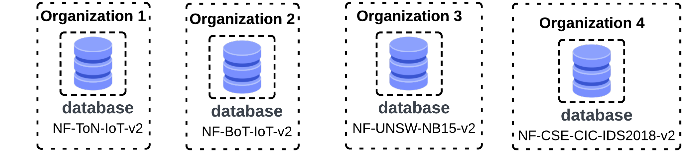

# Prototype 1

## Intro

This prototype aims to evaluate the feasibility of **Federated Learning (FL)** in heterogeneous networks with non-IID data. To compare the results, a _centralized_ and a _local_ approach are going to be used.

## Experiments

This experiment simulates four **Industrial Internet of Things (IIoT)** organizations that desire to train a more robust **Machine Learning (ML)** model for intruder classification. In this context, there are three approaches we can use: _local_, _centralized_ and _federated_.

- Local: A ML model is trained with data from a single organization.
- Centralized: A ML model is trained with a single large dataset that contains all the data from the four organizations aggregated, but violates privacy.
- Federated: A ML model is trained through FL while maintaining the privacy of the data of each client.

To simulate the four organization, four datasets were chosen. All of them have the same features, but with different classes examples. You can found more about the datasets [here](https://staff.itee.uq.edu.au/marius/NIDS_datasets/).



## Runnning

To reproduce this work you should have [poetry](https://python-poetry.org/) installed.

#### Steps

Enter the folder:

```bash
cd prototype_1/
```

Creating a virtual _env_ in the root folder:

```bash
poetry config virtualenvs.in-project true
```

Installing dependencies:

```bash
poetry install
```

Activating the environment:

```bash
poetry shell
```

#### Generating train and test sets

Before running any approach, you have to create the trainining and testing datasets of each client along with the centralized dataset. You can choose the percentual for the test set. Bellow we are divinding the data of each client into 55% for training and 45% for testing.

```bash
cd datasets/
python creating-train-test-datasets.py --name popoola --test-perc 0.45
```

## Folders Structure

- `centralized/`: Code for the centralized approach.

* `local/`: Code for the local approach.

- `federated/`: Code for the federated approach.

* `neural_helper/`: Code for the Neural Network. Contains _train_, _evaluate_model_ and other helper functions.

- `pre_process/`: Contains general-purpose code for reading datasets and data standardization.

* `datasets/`: Contains the datasets and general code related.

- `tunning/`: Code for tunning hyperparameters.
