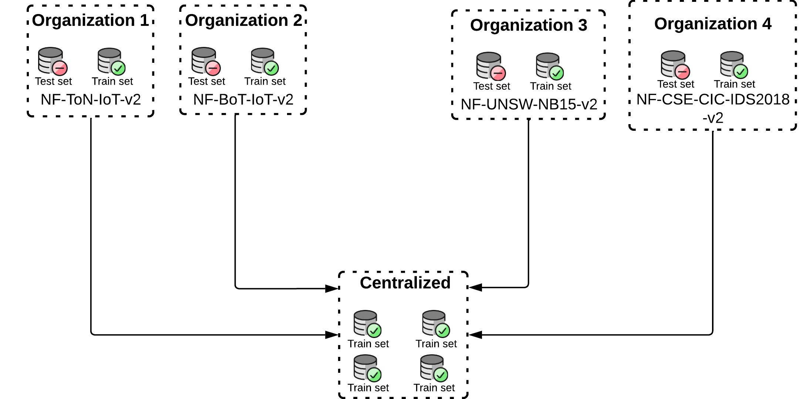

# Centralized Model Training

## Intro

A **Machine Learning (ML)** model is training using the centralized approach. This approach violates user privacy!

## Experiments

A large dataset is build by aggregating the train sets of each client.



In this approach, we train a model using the centralized dataset, then we evaluate the model on the test set of each client.

## Scripts

> **You should be** inside the **prototype_01/** to run the scripts

- The script `main.py` contains the code for training a model and evaluating it on the four clients. After training, all metrics (e.g., accuracy, precision, recall) from each client are saved in a `metrics.json` file within the `metrics/` folder. This script can also train multiple models.

You can specify the amount of models that should be trained with:

```bash
python -m centralized.main --num-models 1
```
