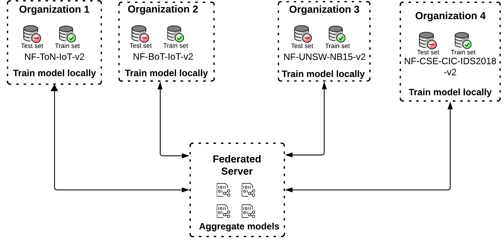

# Federated Model Training

## Intro

A **Machine Learning (ML)** model is training using **Federated Learning (FL)** approach. This approach respects user privacy!

## Experiments

At each round, clients train a model and then send it to a server. The server agregates all the models and conducts a federated evaluation at each client test set. This process repeats for the number of rounds.



## Simulation

A simulation is conducted using the Flower simulation module.

The current code supports two aggregation algorithms: `FedAvg` and `FedProx`.

## Scripts

> **You should be** inside the **prototype_01/** to run the scripts

- [`main.py`](main.py) script loads data from each client to conduct the simulation process. In each round, clients train a local model for `E` epochs. The server then aggregates the models using a chosen strategy (e.g., `FedAvg` or `FedProx`). Finally, a federated evaluation is performed at the end of the round.

The script can be executed with various options to control the federated learning simulation:

- To train a model with 10 rounds of federated learning:

  ```bash
  python -m federated.main --num-rounds 10
  ```

- To use the `FedProx` strategy for aggregation:

  ```sh
  python -m federated.main --algo fedprox --mu 1.0
  ```

<!-- ## Running

To simulate the training of 2 models with 3 rounds each, run:

```sh
bash fl_pipeline.sh -m 2 -r 3
``` -->
