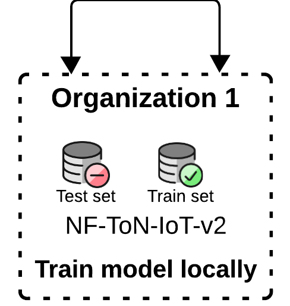

# Local Model Training

## Intro

A **Machine Learning (ML)** model is training using a local approach.

## Experiments

Only one client trains a model using their own train dataset.



After trained, the model will be evaluated using the test sets from three other organizations.

## Scripts

> **You should be** inside the **prototype_01/** to run the scripts

- `main.py` contains the code for training a model locally at each client and then evaluating the local model with the other clients.

  ```bash
  python -m local.main --num-models 1
  ```
